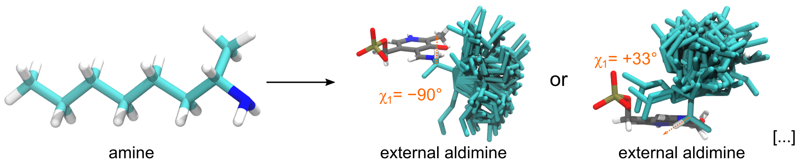
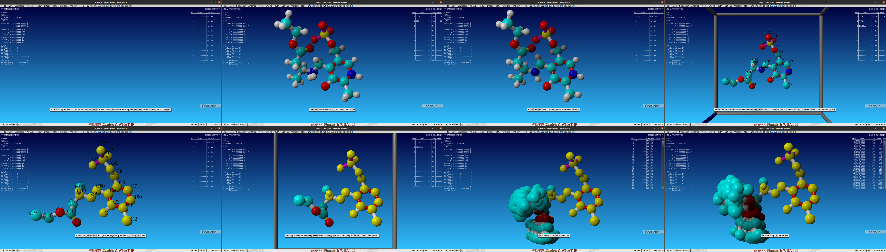
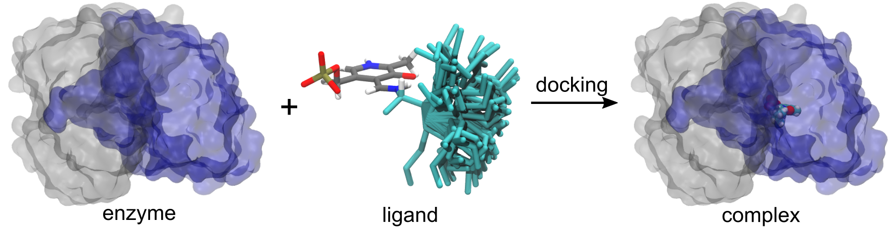
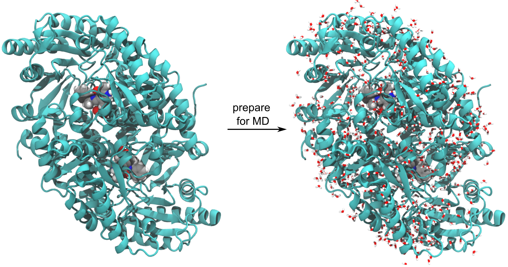
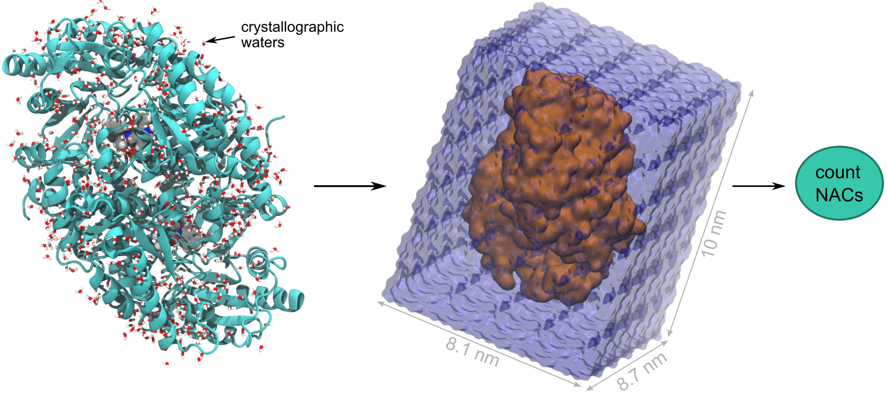

# Predict the *ee*% of the asymmetric synthesis of amines from ketones catalyzed by *Vf*-TA
This is a computational protocol to predict the enantioselectivity (*ee*%) of ω-transaminases using a combination of molecular docking and molecular dynamics simulations. The protocol has been tested in the ω-transaminase from *Vibrio fluvialis* (*Vf*-TA).

## Requirements
*	[YASARA](http://yasara.org/)
*	[Rosetta suite](https://www.rosettacommons.org/)
*	[Gaussian09](https://gaussian.com/glossary/g09/) (optional)
*	[Avogadro](https://avogadro.cc/) (optional)
*	Linux (preferred) or MacOS (untested, but should work)

## STEP 1: Generate the rotamer library

First, we need to generate rotamer libraries of the external aldimine intermediate form of the query compound (ligand). You need the PDB structure of the query amine (*R*- or *S*-amine). Example amines have been provided in `rotamers/input_amines/*.pdb`. 

To generate rotamer libraries, execute the following YASARA macro:
```bash
$PATH_YASARA/yasara -txt generate_rotamers.mcr
```
| I/O      |      file          |  description                |
|----------|--------------------|-----------------------------|
| input    | `01S.pdb`          | structure of query amine    |
| output   | `SUB_rotamers.pdb` | rotamer library (ext. ald.) |
| output   | `SUB.params`       | Rosetta parameters file     |
| output   | `*.sce`            | YASARA scene with rotamer libraries |
| output   | `01S.com`          | input file for RESP calculations    |

The `generate_rotamers.mcr` script takes the amine form of the query compound as input (PDB format) and automatically generates rotamer libraries of the external aldimine form. If a path for the Rosetta script `molfile_to_params.py` was provided, the `generate_rotamers.mcr` macro should have also generated a Rosetta parameters file (`SUB.params`).

:ledger: **Notes**
*	The user-defined parameters in the `generate_rotamers.mcr` macro are `Prune` (the RMSD cutoff for considering two rotamers as unique), `maxNumberRotamers` (the number of rotamers generated before prunning), and `DihedralAngleCH` (user-defined dihedral angle chi_1)
*	A chi_1 angle of -90 degrees places the hydrogen-to-be-abstracted (`H99`) pointing directly toward the catalytic lysine.
*	If you want to use [RESP charges](https://www.sciencedirect.com/science/article/abs/pii/S0166128000004875?via%3Dihub) (for MD), the file `*.com` can be used as input for [Gaussian09](https://gaussian.com/glossary/g09/). There is a `batch_script` file with the necessary commands for running Gaussian09 in [computer clusters](https://slurm.schedmd.com/sbatch.html)
*	The input files can be obtained by drawing the desired amine in [ChemSketch](https://www.acdlabs.com/resources/freeware/chemsketch/index.php) and then doing energy-minimization in [Avogadro](https://avogadro.cc/), or by getting crystal structures directly from the [PDB](https://www.rcsb.org/pages/search_features#search_ligands), or by other means.
*	The `generate_rotamers.mcr` script can also be run in visual mode, allowing the user to see each step taking place. Running the YASARA macro in visual mode can be useful for visual inspection, but for large runs the text-only mode is recommended.
*	To run the YASARA macro in visual mode simply delete the `-txt` flag: `$PATH_YASARA/yasara generate_rotamers.mcr`	

**Screenshots of the **`generate_rotamers.mcr`** YASARA macro in visual mode**


## STEP 2: Generate the enzyme-ligand complex (docking)

Using the rotamer library (`SUB_rotamers.pdb`) and the Rosetta params file (`SUB.params`) produced in the previous step, we can run the [Rosetta Enzyme Design](https://new.rosettacommons.org/docs/latest/application_documentation/design/enzyme-design) application to dock the ligand into the binding site of the enzyme.
But before we do that, we need to align the ligand into the binding site of the enzyme by RMSD fit of the PMP ligand atoms (the atoms of the ligand that originally come from the pyridoxal ring) to the PMP atoms of the original crystal structure (the PMP atoms originally found in e.g., [4E3Q](https://files.rcsb.org/download/4e3q.pdb)). The command is as follows:
```bash
$PATH_YASARA/yasara -txt alignLigand.mcr
```
The YASARA macro should generate `4e3q_forRosetta.pdb`. This is simply the initial positioning of the ligand + enzyme. You can place the ligand anywhere else you want, but Rosetta will have a harder time finding the binding site than if you simply put it in the binding site from the beginning.

Once the ligand has been placed in the binding site of the enzyme, you can run Rosetta docking using the following command:
```bash
$ROSETTA_PATH/main/source/bin/enzyme_design.static.linuxgccrelease @flags -resfile resfile -database $ROSETTA_PATH/main/database/ -enzdes::cstfile enzdes.cst -nstruct 10 -s 4e3q_forRosetta.pdb
```
| I/O      |      file                       |  description                |
|----------|---------------------------------|-----------------------------|
| input    | `4e3q_forRosetta.pdb`           | ENZ:LIG (initial guess)     |
| input    | `SUB_rotamers.pdb`              | LIG rotamer library         |
| input    | `SUB.params`                    | LIG parameters for Rosetta  |
| input    | `flags`                         | settings                    |
| input    | `resfile`                       | mutations                   |
| input    | `enzdes.cst`                    | constraints between LIG-ENZ |
| output   | `4e3q_forRosetta__DE_*.pdb`     | ENZ:LIG (decoys)            |
| output   | `enz_score.out`                 | Goodness of each decoy      |

After having run the previous command, Rosetta should have generated 10 decoys (`4e3q_forRosetta__DE_1.pdb`, `4e3q_forRosetta__DE_2.pdb`, ...), and a file called [enz_score.out](docking/example_out/enz_score.out) that contains a list of Rosetta measurements about the decoys. The most useful measurement is `SR_2_interf_E_1_3` (the Rosetta Interface Energy between the ligand and the enzyme). 

You can visualize the output decoys in YASARA by issuing the following command:
```bash
$PATH_YASARA/yasara 4e3q_forRosetta__DE_1.pdb
```

Since the initial placement of the ligand corresponded roughly to the location of the binding site, Rosetta will probably only have to select among the ligand and protein residue rotamer libraries. [enzdes.cst](docking/input_files/enzdes.cst) contains the list of catalytic residues, and what distances / angles / dihedrals need to be constrained. The `-nstruct` flag tells Rosetta how many decoys to generate. 


:ledger: **Notes**
*	Visual inspection of the genenrated decoys is recommended previous to the MD simulations.
*	If the transaminase does not have a crystallized PMP cofactor, then the [alignLigand.mcr](docking/input_files/alignLigand.mcr) YASARA macro cannot be used to generate `4e3q_forRosetta.pdb`.
*	But, you can align the crystal structure of your transaminase to the crystal structure of a similar transaminase that does contain PMP, and delete the structure of the second transaminase but leave the PMP cofactor. This way, you'll have your original transaminase with PMP (again this step is for the initial placement of the ligand, and can be done in many ways. It's up to the user to decide what's more appropiate for their own specific case). 
*	Beware that some ω-transaminases have distinct conformations when bound/unbound to the cofactor ([Sirin et al., 2014](dx.doi.org/10.1021/ci5002185)).
*	If you want to introduce mutations at the same time, it can easily be done through the file called `resfile`. For example:

```
85 B PIKAA ACD
151 A PIKAA ACDEFGHIKLMNOPQRSTVWY
118 A PIKAA NATRO
```

will tell Rosetta to mutate (`PIKAA`) position 85 of subunit B into either Alanine, Cysteine, or Aspartate. `AND` to mutate position 151 of subunit A into either of the 20 cannonical amino acids (including the wild-type amino acid). `AND` to keep the residue 118 of subunit A in its NATural ROtamer form (`NATRO`). For more information visit: https://www.rosettacommons.org/docs/latest/application_documentation/design/enzyme-design 

## STEP 3: Prepare the docked complex for MD simulations

The previous step should have generated a docked complex that we can use as starting point for MD simulations. The structure of the docked complex does not contain water molecules, since they were deleted because water molecules are usually not handled well by docking algorithms. Before MD simulations, it is a good idea to put the crystallographic water molecules back into their original position. 
```bash
$PATH_YASARA/yasara -txt ConvertRosettaPdbB2WOW.mcr "Scaffold = 'example_input/4e3q_cleaned'" "MacroTargetA = 'example_input/4e3q_forRosetta__DE_6'" "MacroTargetB = 'example_input/4e3q_forRosetta__DE_6_B__DE_1'"
```
The script produces a YASARA object file (YOB) containing the water molecules from the first file (`example_input/4e3q_cleaned`), the ligand from the second file (`example_input/4e3q_forRosetta__DE_6`), and the enzyme structure from the third file (`example_input/4e3q_forRosetta__DE_6_B__DE_1`). What we are defining is the `Scaffold` (original protein + water), the `MacroTargetA` (enzyme + ligand docked in the binding site A), and the `MacroTargetB` (enzyme + ligand docked in the binding site B)

:ledger: **Notes**
*	Adding back the crystallographic water molecules is a necessity if the molecular dynamics simulations are short (<< 1 ns). Else, you can skip this step.
*	Note that `4e3q_forRosetta__DE_6` was the sixth decoy obtained from **step 2**. This decoy contains the ligand (SUB) docked in the binding site formed mainly by residues of subunit A (binding site A), while the binding site B is empty. To perform MD simulations we have three options:   1) leave binding site B empty, 2) add PMP to binding site B, 3) dock a second ligand (external aldimine) to binding site B. The first alternative is OK, but transaminases are less stable without a PMP cofactor ([Börner et al., 2017](https://doi.org/10.1002/cbic.201700236)). The second alternative is better in this regard, but we might want to make use of the binding site B for actual calculations with the ligand. The third alternative requires you do to do a second docking step (**step 2**) on the binding site B. In the example input files shown, `4e3q_forRosetta__DE_6_B__DE_1` is the result of performing a second docking step on `4e3q_forRosetta__DE_6` this time in the binding site B.

## STEP 4: Perform the MD simulations on the docked structures 

Now, we need to carry out MD simulations using the docked structures as starting conformation. And from the MD trajectory, we count the number of near-attack conformations (reactive poses) to calculate the *ee*% of the enzyme toward the query compound.
The only input needed is the YOB file generated in **STEP 3**.

To run the MD simulations, issue the following command:

```bash
$PATH_YASARA/yasara -txt MDSimulation.mcr "MacroTarget ='example_input/4e3q_forRosetta__DE_1_B__DE_1_WOW'" "CurrentSetting ='MultiShort'"
```
The YASARA macro will take of everything (solvation, minimization, equilibration, simulation, and analysis). The example provided is for 5 replicas of 20 ps each.

:ledger: **Notes**

*	The MD simulation parameters can be controlled with the `CurrentSetting` flag (see `MDSimulation.mcr`). 
*	The file listing the geometric criteria is `NACGeometricCriteria.mcr`. If this file is provided, YASARA will calculate analyze the simulations on-the-fly and calculate the percentage of reactive poses.
*	Example output files are provided in `MD/example_output`, for the 5x20 ps setup: 5 replicas of 20 ps each. 
*	In the example provided, the number of NACs counted for subunit A is 3.78 (average across 5 replicas). This number can be found in the file `4e3q_forRosetta__DE_1_B__DE_1_WOW_LSOn_F_2000fs_20000fs_NAC_Results_ZZZ_Combinations_All5Seeds_Summary.tab`.
*	NACs% can be recalculated by using the TAB files that contain the geometric criteria measurements taken across the 20 ps trajectory, e.g. `4e3q_forRosetta__DE_1_B__DE_1_WOW_F_01_A_LSOn00001.tab` is from replica 01 binding site A. The first column is the *time*, the second is whether this frame is a NAC or not (`0.0000` means `no`, `1.0000` means `yes`), the third column is the *criteria_1*, the fourth column is whether *criteria_1* passed the NAC criteria (`0.000` means `no`, `1.0000` means `yes`), the fifth colum is the *criteria_2*, the sixth column is whether *criteria_2* was passed or not, etc...

## STEP 5: Calculate the enantiomeric excess (*ee*%) 
Once the MD simulations have been run, you can calculate the *ee*% of the query compound by comparing the %NACs generated by the (R)- and (S)-enantiomer (`NACs_R` and `NACs_S`, respectively).
The formula is: 
```math
ee% = (NACs_S - NACs_R) / (NACs_S + NACs_R) * 100%
```

